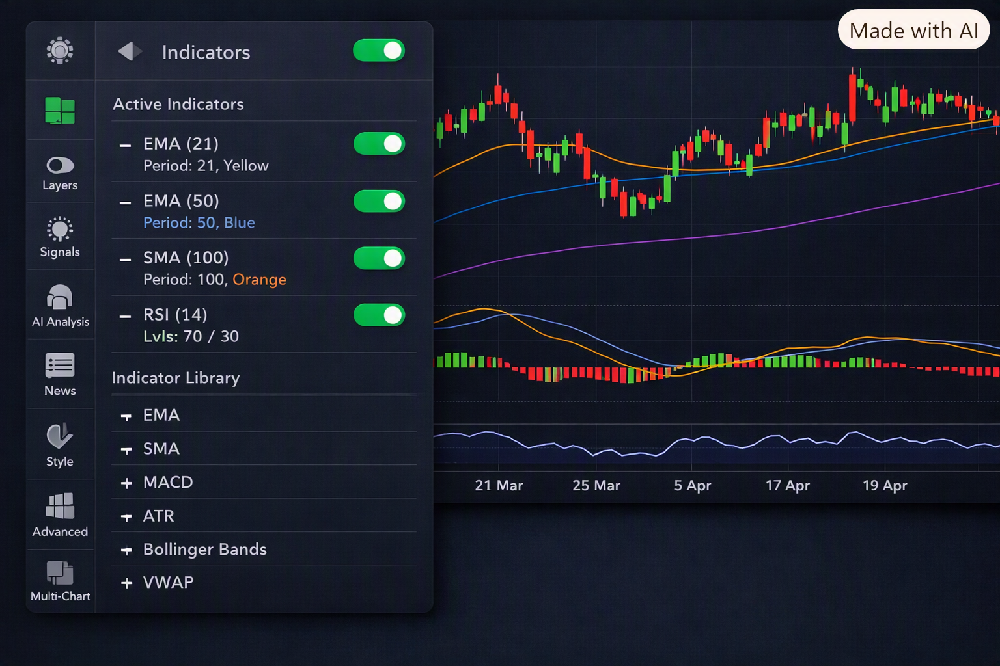

# TraderBOT

A market-data collection, analysis and decision-support system for crypto (spot + futures,
five venues) and macro/economic data — written in plain **Node.js (CommonJS)** on purpose:
no Express/Fastify, servers built directly on `node:http`, storage on `better-sqlite3`.



## What it does

```
Exchanges (Binance / Bybit / OKX / KuCoin / Bitget)
        │
        ├── realtime/  ──(WebSocket)──► spot & futures ──► aggregator ──► state
        │                                    │
        │                                    ▼
        │                            analytics-engine  ──► readings (NDJSON + bus)
        │
        └── historical/ ──(HTTP klines)──► full/ ──► candles_1m.db   (raw 1-minute only)
                                                          │
                                        ┌─────────────────┴──────────────────┐
                                        ▼                                    ▼
                            _engine/timeframe/build-tf.cjs      _engine/summary-dynamic/build-summary.cjs
                            (on-demand higher timeframes)       (on-demand summaries)
                                        │                                    │
                                        └──────────► api/ ◄──────────────────┘
                                              GET /tf/:symbol/:tf
                                              GET /summary/:symbol/:tf

Macro (FRED / OECD / Eurostat / IMF / BIS / World Bank / OWID)
        └── collector/macro ──► macro.db ──► query/ + assistant/ ──► collector/macro/api
```

Design rule after the last refactor: **only the raw 1-minute candle is persisted**; every
timeframe, indicator, zone and summary is computed on demand. The retired Smart Engine
(`tf_small` / `tf_large` / `zone` tables, old `/summary` `/indicators` `/zones` API) lives in
`collector/.../_legacy/`.

## Repository layout

| path | role |
| --- | --- |
| `collector/` | data collection core (largest part) |
| `collector/crypto/realtime/` | WebSocket collection: candles, depth, trades, orderflow, funding, OI, liquidations, spread |
| `collector/crypto/historical/` | historical engine: venue fetchers, `full/` downloader, on-demand timeframe/summary builders, `api/` |
| `collector/crypto/onchain/` | on-chain subjects (exchange reserves, whale transfers, stablecoins, lending, ETF quotes) |
| `collector/crypto/derivatives/` | derivatives streams and venue adapters |
| `collector/liquidity_6markets/` | liquidity across crypto, FX, indices, commodities, bonds, real estate/credit |
| `collector/globalliquidity/` | global-liquidity ingestors, processors, alert engine, dashboard |
| `collector/macro/` | macro collector: `update/` live updater, `offline/` bulk downloaders, `query/`, `assistant/`, `memory/`, `core_db/`, `api/` |
| `analytics-engine/` | envelope → topic router producing readings (CVD, imbalance, OI/funding, spreads, indicators, price action, macro correlation, relative strength, leverage risk, on-chain flow) |
| `bot-engine/` | decision/bot layer |
| `orchestrator/` | module orchestration, event router, state tree, health monitor, web dashboard + admin API |
| `frontend/` | Next.js 16 dashboard (charts, macro views, i18n) |
| `roadmap-site/` | Next.js marketing/roadmap site (RADICOIN) |
| `data/` | runtime data root (generated — see *Data policy*) |
| `test/` | 29 end-to-end/integration test scripts |
| `scripts/` | maintenance scripts (`historical-updater.sh`, review tools) |
| `ZDoc/`, `*.md` | design notes, audits and plans |

## Requirements

* Node.js 20+ (CommonJS).
* Build toolchain for native modules (`better-sqlite3`, `tulind`) — `python3`, `make`, `g++`.
* `puppeteer` pulls a headless Chromium on install.

```bash
npm install                      # root: better-sqlite3, ws, csv-parse, parquetjs-lite, tulind, unzipper, puppeteer
npm --prefix frontend install    # Next.js dashboard
npm --prefix roadmap-site install
```

## Running

```bash
# --- crypto historical: download + keep candles_1m.db up to date ---
node collector/crypto/historical/full/run-update-all.cjs BTCUSDT

# --- crypto realtime + derivatives (WebSocket) ---
node collector/crypto/realtime/server.cjs

# --- six-market liquidity (published on the realtime bus) ---
node collector/liquidity_6markets/server.cjs --bus

# --- on-chain subjects ---
node collector/crypto/onchain/server.cjs --bus

# --- analytics engine: consumes the bus, writes one NDJSON line per reading ---
node analytics-engine/server.cjs --bus --out data/analytics/analytics.ndjson

# --- historical candles API (on-demand timeframes/summaries) ---
node collector/crypto/historical/api/server.cjs

# --- macro: live update loop, API, orchestrator dashboard ---
node collector/macro/update/update_live.cjs
node collector/macro/api/server.cjs
node orchestrator/api/server.cjs

# --- frontends ---
npm --prefix frontend run dev        # dashboard
npm --prefix roadmap-site run dev    # roadmap site on :4500
```

`run-master.sh` is the master loop: crypto update every minute, macro update every 2 hours
(install it as `traderbot-master.service` — see the comments inside the script).

## Configuration & secrets

Provider keys are resolved in this order (see `collector/macro/config/config.cjs`):

```
MACRO_<SOURCE>_API_KEY  →  <SOURCE>_API_KEY  →  FRED_API_KEY  →  collector/macro/config/keys.json
```

Copy `collector/macro/config/keys.example.json` to `collector/macro/config/keys.json` and fill
in your own keys. **`keys.json` is git-ignored on purpose — never commit real keys.** Most
sources work keyless (FRED `fredgraph.csv`, OECD SDMX, Eurostat, IMF, BIS, World Bank, OWID);
the key is only needed to switch FRED to its JSON API.

## Data policy (why the clone is small)

The working tree is ~17 GB; this repository tracks **only source, configuration and
documentation**:

| ignored | size on the dev box | how to regenerate |
| --- | --- | --- |
| `collector/macro/db/macro.db` | 7.3 GB | `node collector/macro/update/update_live.cjs` |
| `collector/crypto/historical/crypto/**/candles_1m.db` | 4.6 GB | `node collector/crypto/historical/full/run-full.cjs` |
| `collector/macro/offline/**` (BIS/World Bank/OECD/IMF dumps) | 2.0 GB | `node collector/macro/offline/<source>/download_<source>_offline.cjs` |
| `data/historical/**/*.parquet` (840 files) | 1.3 GB | re-run the historical downloader |
| `*.db`, `*.csv`, `*.zip`, `*.xlsx`, `*.parquet`, `*.log`, `*.pid`, `node_modules/`, `.next/` | ~1 GB | — |

`data/.gitkeep` keeps the data root in the tree so runtime paths resolve.

## Publishing to GitHub

The repository is initialised on `main` with a single squashed initial commit. To publish:

```bash
gh auth login --hostname github.com --git-protocol https --web   # once
bash scripts/publish-to-github.sh                                # private repo "TraderBOT"
bash scripts/publish-to-github.sh TraderBOT --public             # public instead
```

The helper is idempotent: it creates the repo and pushes the first time, and only pushes on
later runs.

## Tests

```bash
node test/<name>.test.cjs                     # e.g. node test/chart-data-service.test.cjs
bash test/run-realtime-live-health.sh         # live venue health (needs network)
node analytics-engine/tests/<name>.test.cjs
```

## Documentation index

`CHART_ENGINE_V2_ARCHITECTURE.md` · `HISTORICAL_CHARTS_PLAN.md` ·
`MACRO_DATA_INVENTORY.md` · `MACRO_SOURCE_INVENTORY.md` · `MACRO_INFLATION_COVERAGE.md` ·
`CPI_YOY_DATA_AUDIT.md` · `MACRO_HANDOFF_v3.md` · `ROADMAP_FRONTEND.md` · `planC.md` ·
`TraderBOT.txt` (structural walkthrough) · `ZDoc/` (design notes) ·
`analytics-engine/README.md` (topic reference).

---

## خلاصهٔ فارسی

TraderBOT یک سیستم جمع‌آوری و تحلیل دادهٔ بازار است که با **Node.js (CommonJS)** و بدون
فریم‌ورک خارجی نوشته شده (سرورها روی `node:http` و ذخیره‌سازی روی `better-sqlite3`).

* `collector/` هستهٔ جمع‌آوری است: `crypto/realtime` (WebSocket)، `crypto/historical`
  (دانلود تاریخی + `candles_1m.db` فقط کندل خام ۱ دقیقه‌ای)، `crypto/onchain`،
  `liquidity_6markets`، `globalliquidity` و `macro/` (FRED/OECD/Eurostat/IMF/BIS/World Bank).
* `analytics-engine/` رویدادهای collector را به «قرائت‌ها» (readings) تبدیل می‌کند؛
  `orchestrator/` مدیریت ماژول‌ها و داشبورد؛ `frontend/` و `roadmap-site/` دو اپ Next.js هستند.
* فقط کندل خام ۱ دقیقه‌ای persist می‌شود؛ تایم‌فریم‌ها، اندیکاتورها و خلاصه‌ها در لحظه از
  روی دادهٔ خام ساخته می‌شوند.
* **کلیدهای API را در `collector/macro/config/keys.json` بگذارید** (از `keys.example.json`
  کپی کنید). این فایل در گیت ignore شده و هرگز نباید کامیت شود.
* **پایگاه‌داده‌ها و داده‌های سنگین (حدود ۱۵ گیگابایت) در ریپازیتوری نیستند** و با اجرای
  دوبارهٔ collectorها بازسازی می‌شوند — فایل `.gitignore` را ببینید.
